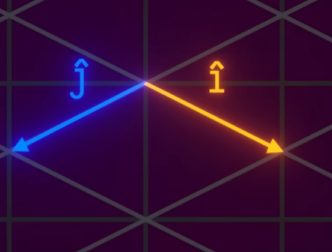
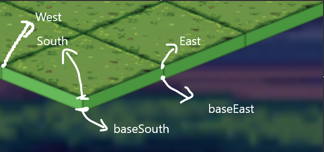

# `getImage(src)`
### Description
Given an image URL `src`, returns the corresponding `HTMLImageElement` (the actual `` object the canvas can draw).

Acts as a cache in the JS memory (RAM).  if the image was already loaded before, it returns the cached version instantly instead of loading it again from the network.

### How it works
```
1st call with "assets/tiles/floor.png"
  → not in cache yet
  → create a new Image(), set its src
  → store it in imageCache
  → return it (might still be loading)
 
2nd call with "assets/tiles/floor.png"
  → already in cache!
  → return it instantly (fully loaded this time)
```
This matters because `renderBoard()` is called on every grid change. Without the cache, it would create hundreds of new Image objects per second, the browser would be constantly re-downloading the same files.


***_______________________________________________________________________________________***
## `toIso(col, row, config)`
 
### Description
Given a tile's position in the **Game Grid** `(col, row)`, returns its position (center point) in **pixels** on the canvas `(screen_x, screen_y)`
the same coordinates you'd see in the F12 devtools.


### How it works
 
Two basis vectors define how one grid step translates to pixels on screen:
```
i vector (one col step): (+1×w,  +0.5×h)  → go RIGHT and DOWN
j vector (one row step): (-1×w,  +0.5×h)  → go LEFT  and DOWN
```

Then to find any tile's screen position, walk `col` i-steps and `row` j-steps from the origin:
```
screen_x = col × (+1×w) + row × (-1×w)  =  (col - row) × w
screen_y = col × (0.5×h) + row × (0.5×h) =  (col + row) × 0.5×h
```

Then shift by `originX/originY` (constants) so the grid is centered on screen instead of starting at pixel `(0,0)`.

***_______________________________________________________________________________________***


## `buildPolygonPath(ctx, points)`
### Description
This is a utility method designed to automate "connecting the dots." Since every isometric tile, shadow, or highlight is essentially a diamond shape (a polygon), this method traces the outline of that shape on the canvas. 

**Note:** This method only creates the path (the invisible line). To actually see it on your screen, you must follow it with `ctx.fill()` (to color it in) or `ctx.stroke()` (to draw the outline).

---

### How it Works
Think of the `ctx` (Canvas Context) as a robot holding a pen over a piece of paper. This method gives the robot a list of coordinates to follow:

1.  **`ctx.beginPath()`**: The robot lifts the pen and clears its memory of any previous shapes. It’s a "fresh start."
2.  **`ctx.moveTo(points[0].x, points[0].y)`**: The robot moves its arm to the **first coordinate** in your array. Crucially, the pen is **up**—no line is drawn yet. This sets your starting corner.
3.  **The `for` loop (Starting at index 1)**:
    * **`ctx.lineTo(...)`**: The robot puts the pen **down** and draws a straight line from its current position to the next coordinate in the `points` array.
    * It repeats this for every point in the list (Point 1 to Point 2, Point 2 to Point 3, etc.).
4.  **`ctx.closePath()`**: The robot draws one final line from wherever it currently is back to the **starting point** (`points[0]`). This perfectly seals the diamond shape so there are no gaps.

---
### Why Use This?
In an isometric grid, you aren't drawing simple squares. You are drawing "squashed" diamonds. To draw a single tile, your code calculates 4 specific points:
* **Point 0:** Top corner
* **Point 1:** Right corner
* **Point 2:** Bottom corner
* **Point 3:** Left corner


***_______________________________________________________________________________________***
## `drawWallDepth(params, colors)`

### Description
This method provides the "3D" depth for the grid. It draws the vertical thickness (the walls) of the tiles. Usually, this is only visible on the tiles at the very edges of the map (the "bottom" and "right" sides of the diamond).

### How it Works
It creates a 3D effect by "extruding" the tile downwards:

1.  **Drop the Points:** It takes the `y` coordinates of the surface corners and adds `thickness` (a pixel value) to them. 
    * `baseSouth.y = south.y + thickness`
2.  **Trace the Side Walls:** * **Left Wall:** A 4-point polygon connecting: Top-West, Top-South, Bottom-South, Bottom-West.
    * **Right Wall:** A 4-point polygon connecting: Top-South, Top-East, Bottom-East, Bottom-South.
3.  **Visual Depth:** It fills these polygons with colors that are typically darker than the top surface, creating a "shadow" effect that sells the 3D illusion.




<br>
<br>

## `drawAssetsOnTile(params, col, row, config)`
### Description
The "Object Layer" renderer. Once the tile floor is drawn, this method places interactive elements (Items) and entities (Players) on top of it. It handles positioning, scaling, and juice (animations).

### How it Works
1.  **Center Calculation:** It finds the exact pixel center of the diamond tile to ensure objects aren't floating off to the side.
2.  **Item Animation:** * Uses `Math.sin()` combined with `Date.now()` to create a smooth, looping "bobbing" effect for items.
    * Items are scaled based on a `itemWidthRatio` so they fit perfectly inside the tile boundaries.
3.  **Player Rendering:**
    * **Shadows:** Draws a `ctx.ellipse` at the center of the tile before drawing the player to ground them in the world.
    * **Depth Offset:** Adjusts the player's vertical position so they appear to be "standing" on the tile rather than plastered flat against it.
    * **Glow Effect:** If the player's ID matches the `localPlayerSocketId`, it applies a `shadowBlur` to create a "Hero Glow."

### Technical Note: Aspect Ratio
The method calculates `aspect = img.width / img.height`. This ensures that whether your character is a tall elf or a wide dwarf, the image won't look "squashed" or "stretched" when resized to fit the tile.

<br>
<br>

## `drawIsometricTile(params, wallParams, config)`
### Description
The "Layer Manager" for a single tile. It executes the drawing process in a specific order to ensure that textures, highlights, and players are layered correctly (Depth Sorting).

### The Rendering Pipeline (Order of Operations)
1.  **Floor Fill:** Paints the basic background color of the tile.
2.  **Texture Mapping:** Clips the canvas to a diamond and "squashes" the tile image (e.g., grass.png) to fit.
3.  **Gameplay Highlights:** If the tile is "Reachable" or "Teleportable," an overlay color is painted on top.
4.  **Grid Outline:** Draws the `stroke()` (the black/grey border) around the tile.
5.  **3D Depth:** Calls `drawWallDrops()` to add vertical thickness.
6.  **Entity Layer:** Calls `drawAssetsOnTile()` to place items and players.

### Why the Order Matters
If we called `drawAssetsOnTile` before `ctx.fill()`, the player would be buried under the grass! This method ensures the "Floor" is always at the bottom and the "Players" are always at the top.

<br>
<br>

## `drawDirectionKey(ctx, keyChar, col, row, config)`
### Description
Draws the WASD navigation keys directly onto the game world floor. It uses a **Linear Transformation Matrix** to tilt the 2D key icons so they align with the isometric perspective.

### How it Works: The Matrix Warp
Instead of calculating every corner of the button manually, this method "warps" the canvas coordinate system:

1.  **Reference Points:** It finds the isometric coordinates for one grid square (North, East, West).
2.  **`ctx.transform()`**: It redefines the Canvas X and Y axes to match the edges of that isometric diamond.
    * The first two parameters define the **Isometric X direction** (Right-Down).
    * The next two define the **Isometric Y direction** (Left-Down).
    * The last two set the **Origin** (where the button starts).
3.  **Standard Drawing:** It draws a normal 2D rounded rectangle and text. Because the "paper" is tilted, the drawing automatically looks 3D.

### Visual Polish
* **`ctx.quadraticCurveTo`**: Used to create the rounded corners of the keys.
* **`textBaseline = 'middle'`**: Ensures the "W", "A", "S", or "D" stays perfectly centered inside the tilted box.

#### The "Matrix" Consistency
Both methods use the same logic:
1. Get the **North** (Origin), **East** (X-axis), and **West** (Y-axis) points.
2. Calculate the difference between them.
3. Apply the `ctx.transform()` to "lie the image flat" on those points.
---

### Why use `transform` instead of `toIso` for every point?
By warping the whole canvas, we can use simple commands like `ctx.fillText` or `ctx.rect` and they will automatically follow the 3D perspective. It’s much easier than trying to calculate the isometric position of every single pixel in a letter like "W".


<br>
<br>

## `renderBoard(config)`
### Description
The main entry point for the renderer. It calculates the layout, handles the camera transformations, and loops through the grid to draw every tile and entity.

### Key Responsibilities
1.  **Scaling (`fitTileW`):** Automatically calculates the ideal tile size so the entire map fits the user's current window width.
2.  **Camera Control:** * Applies `ctx.scale` for zooming.
    * Applies `ctx.translate` for panning (camera.x/y).
    * Ensures zooming is centered on the screen.
3.  **Vertex Mapping:** Pre-calculates all grid intersection points (`toIso`) into a 2D array. This prevents redundant math during the drawing phase.
4.  **The Draw Loop:** Iterates through the grid coordinates. For each tile, it identifies the four specific corners from the vertex map and passes them to `drawIsometricTile`.
5.  **UI Layer:** After the grid is finished, it draws the WASD direction keys at the edges of the map.